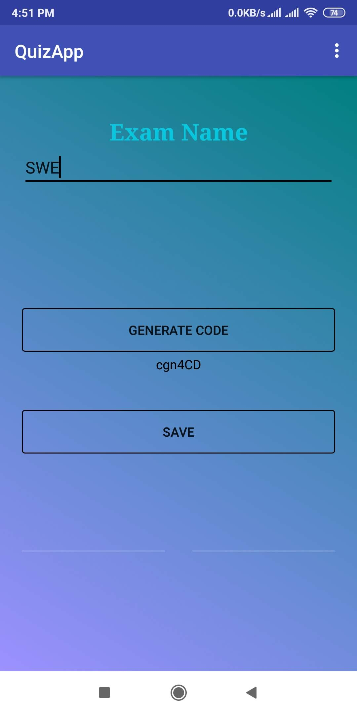
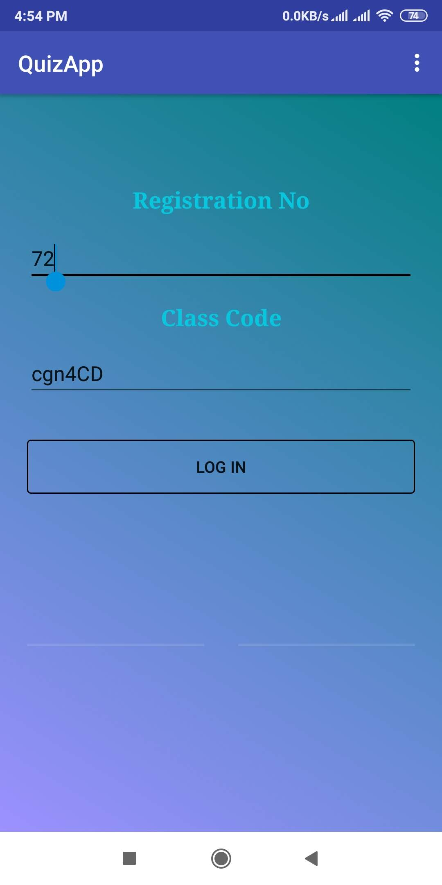
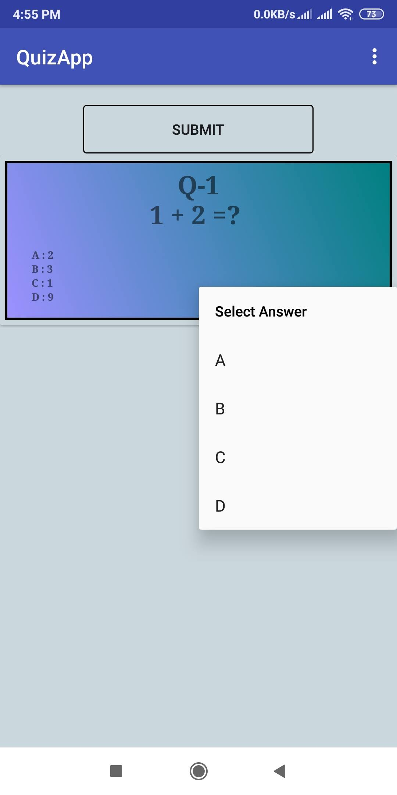
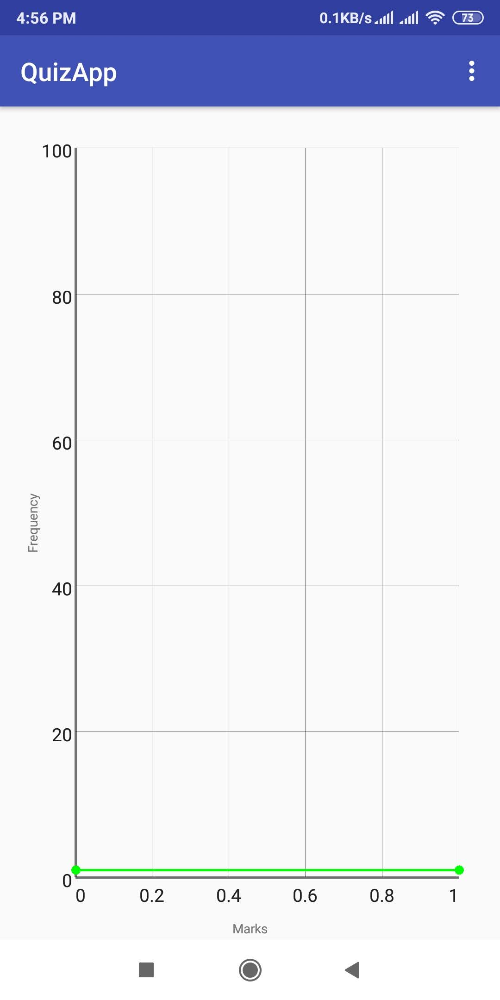

# QuizApp

 

## Intro
It was developed as a part of the coursework for Software Engineering & Design Pattern course (2/2)

## About App
Using this App one can conduct mcq exam .

*First - Create Class & generate Class code

*Second - Add mcq's to that Class

*Third - Distribute Class code among the students

Students can access that class using class code and give exam.

Result will automatically be calculated , therefore everyone can see their marks & rank.

**Some SS from QuizApp:**

 
 
 
 
 
